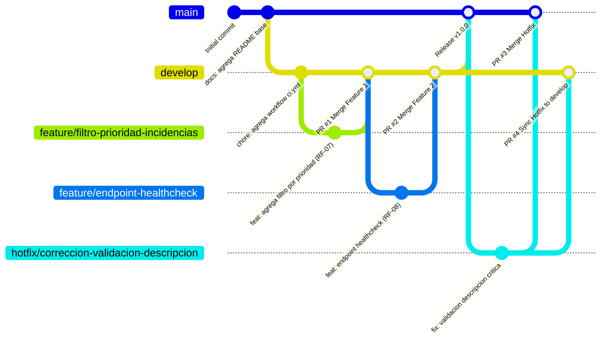

# 🛠️ Sistema de Gestión de Incidencias - Pipeline DevOps
> **Asignatura:** Ingeniería DevOps (DOY0101)  
> **Evaluación:** Evaluación Parcial N°1: "Tu primer pipeline de despliegue"  
> **Institución:** Duoc UC  
> **Equipo / Autores:** Francisca López & Nicolás  

---

## 📑 Tabla de Contenidos
1. [Descripción General del Proyecto](#-descripción-general-del-proyecto)
2. [Modelos de Ramificación y Justificación (IE1)](#-1-modelos-de-ramificación-y-justificación-ie1)
   - [Comparativa de Modelos de Ramificación](#comparativa-de-modelos-de-ramificación)
   - [Justificación de la Elección de GitFlow](#justificación-de-la-elección-de-gitflow)
3. [Guía de Buenas Prácticas para Repositorios DevOps (IE5)](#-2-guía-de-buenas-prácticas-para-repositorios-devops-ie5)
   - [Estructura del Proyecto](#estructura-del-proyecto)
   - [Convenciones de Naming de Ramas](#convenciones-de-naming-de-ramas)
   - [Convención de Commits (Conventional Commits)](#convención-de-commits-conventional-commits)
   - [Políticas de Pull Requests y Estrategias de Merge](#políticas-de-pull-requests-y-estrategias-de-merge)
4. [Simulación del Flujo de Trabajo Colaborativo (IE2)](#-3-simulación-del-flujo-de-trabajo-colaborativo-ie2)
   - [Diagrama de Trazabilidad GitFlow](#diagrama-de-trazabilidad-gitflow)
   - [Registro de Ramas, Features y Hotfixes](#registro-de-ramas-features-y-hotfixes)
   - [Comandos Git Utilizados Paso a Paso](#comandos-git-utilizados-paso-a-paso)
5. [Automatización y Pipeline CI/CD con GitHub Actions (IE3 / IE4)](#-4-automatización-y-pipeline-cicd-con-github-actions-ie3--ie4)
   - [Rol de la Automatización y CI/CD en la Nube](#rol-de-la-automatización-y-cicd-en-la-nube)
   - [Explicación del Pipeline `.github/workflows/ci.yml`](#explicación-del-pipeline-githubworkflowsciyml)
   - [Simulación en Entorno Cloud](#simulación-en-entorno-cloud)
6. [Conclusiones y Reflexiones Individuales](#-5-conclusiones-y-reflexiones-individuales)

---

## 📖 Descripción General del Proyecto

Este repositorio contiene la base de código y la arquitectura de integración continua para el **Sistema de Gestión de Incidencias**, un microservicio fullstack desarrollado para centralizar, categorizar y gestionar el ciclo de vida de incidentes y requerimientos técnicos internos (solicitudes de soporte, fallas de hardware, accesos y software).

### Componentes de la Solución
* **Backend:** Microservicio RESTful construido en **Java 21 con Spring Boot 4**, Spring Data JPA, Maven y Lombok.
* **Frontend:** Panel web intuitivo y responsivo en **HTML5, CSS3 y JavaScript moderno (Fetch API)**.
* **CI/CD:** Automatización de integración continua mediante **GitHub Actions** en entornos Ubuntu Cloud Runners.

---

## 🌿 1. Modelos de Ramificación y Justificación (IE1)

Las estrategias de ramificación (*Branching Strategies*) definen las reglas y patrones con los que los equipos de ingeniería colaboran, integran cambios y liberan software a producción en entornos Cloud.

### Comparativa de Modelos de Ramificación

| Modelo de Ramificación | Dinámica Principal | Ventajas en Entornos Cloud | Desventajas / Limitaciones | Caso de Uso Ideal |
| :--- | :--- | :--- | :--- | :--- |
| **GitFlow** | Múltiples ramas de larga duración (`main`, `develop`) apoyadas por ramas temporales (`feature/*`, `release/*`, `hotfix/*`). | Máximo control de versiones, aislamiento estricto de producción y desarrollo, soporte para despliegues programados y parches urgentes sin afectar trabajo en curso. | Mayor complejidad de gestión de ramas, riesgo de *merge conflicts* si las ramas de *feature* tienen un ciclo de vida excesivamente largo. | Microservicios y sistemas empresariales con ciclos de release formales, auditoría de versiones y necesidad de estabilización previa. |
| **GitHub Flow** | Modelo simplificado basado en una única rama principal (`main`) y ramas de funcionalidad cortas (`feature/*`) que se integran mediante Pull Requests. | Simplicidad operativa, ideal para Despliegue Continuo (CD) automatizado y feedback ultrarrápido. | Menor control sobre versiones concurrentes; todo lo que se mergea va directamente a producción. | Aplicaciones web SaaS, microservicios orientados a despliegues diarios continuos. |
| **Trunk-Based Development** | Todos los desarrolladores commitean frecuentemente (varias veces al día) a una rama principal compartida (*trunk*), utilizando *Feature Flags*. | Elimina el "infierno de merges" (*Merge Hell*), promueve integración continua real y alta velocidad de entrega. | Exige una cobertura de pruebas automatizadas extremadamente alta y gran madurez técnica del equipo. | Equipos DevOps avanzados con suites de tests automatizados maduros y pipelines de CD robustos. |
| **GitLab Flow** | Combina ramas de características con ramas específicas por entorno (`staging`, `production`) o por versión. | Excelente trazabilidad entre ramas y entornos de infraestructura cloud (Dev -> PreProd -> Prod). | Puede generar redundancia en la propagación de commits si no se automatizan los flujos de promoción. | Arquitecturas multinube o multi-entorno con políticas estrictas de paso a producción. |

### Justificación de la Elección de GitFlow

Para el proyecto de **Sistema de Gestión de Incidencias**, el equipo seleccionó **GitFlow** por las siguientes razones técnicas y operativas:

1. **Aislamiento Seguro de Ambientes (Producción vs. Desarrollo):** La rama `main` refleja en todo momento la versión estable y productiva del microservicio. La rama `develop` actúa como la zona de integración donde convergen las nuevas capacidades sin riesgo de impactar la estabilidad del servicio.
2. **Capacidad de Respuesta ante Incidentes Críticos (`hotfix/*`):** Permite generar parches de emergencia directamente desde `main` ante fallos críticos en producción, asegurando que la corrección se despliegue a producción y se sincronice de vuelta a `develop` sin incluir código experimental o incompleto.
3. **Paralelismo y Trazabilidad en Equipos Distribuidos:** Permite que varios integrantes trabajen de manera simultánea en requerimientos funcionales independientes (`feature/filtro-prioridad-incidencias`, `feature/endpoint-healthcheck`), facilitando revisiones de código aisladas antes de la integración.

---

## 📐 2. Guía de Buenas Prácticas para Repositorios DevOps (IE5)

### Estructura del Proyecto

El repositorio adopta una separación clara de responsabilidades en concordancia con los principios de arquitectura limpia y desacoplamiento de componentes:

```text
sistema_incidencias-/
├── .github/
│   └── workflows/
│       └── ci.yml               # Configuración del Pipeline de CI en GitHub Actions
├── backend/                     # Microservicio API REST (Spring Boot)
│   ├── .mvn/                    # Configuración de Maven Wrapper
│   ├── docs/                    # Especificaciones funcionales y técnicas del sistema
│   │   └── documentacion.md
│   ├── src/
│   │   ├── main/
│   │   │   ├── java/com/sistemaIncidencias/grupo8/
│   │   │   │   ├── config/      # Configuraciones globales (CORS, Beans)
│   │   │   │   ├── controller/  # Controladores REST API
│   │   │   │   ├── models/      # Entidades de dominio y Enums
│   │   │   │   ├── repository/  # Interfaces de acceso a datos (JPA)
│   │   │   │   └── services/    # Lógica de negocio
│   │   │   └── resources/       # Archivos de propiedades (application.properties)
│   │   └── test/                # Pruebas unitarias y de integración
│   ├── mvnw / mvnw.cmd          # Maven Wrapper para Linux/macOS y Windows
│   └── pom.xml                  # Dependencias y plugins del backend
├── frontend/                    # Cliente Web Ligero (SPA)
│   ├── app.js                   # Lógica de interacción y consumo de API REST
│   ├── index.html               # Estructura semántica de la interfaz
│   └── style.css                # Estilos visuales responsivos
├── .gitignore                   # Exclusión de binarios, dependencias y temporales
├── .gitattributes              # Normalización de saltos de línea (CRLF/LF)
└── README.md                    # Documentación técnica integral del repositorio
```

---

### Convenciones de Naming de Ramas

Todas las ramas creadas en el repositorio deben ajustarse a la siguiente nomenclatura estándar en minúsculas y separadas por guiones (*kebab-case*):

* `main`: Rama de producción. Contiene código 100% probado, estable y desplegable.
* `develop`: Rama de integración activa para desarrollo continuo.
* `feature/<modulo-o-funcionalidad>`: Ramas de características creadas a partir de `develop`.  
  *Ejemplo:* `feature/filtro-prioridad-incidencias`, `feature/endpoint-healthcheck`.
* `hotfix/<descripcion-del-bug>`: Ramas para correcciones críticas en producción creadas a partir de `main`.  
  *Ejemplo:* `hotfix/correccion-validacion-descripcion`.
* `release/<version>`: Ramas de preparación de release para pruebas de aceptación y control de versiones.  
  *Ejemplo:* `release/v1.0.0`.

---

### Convención de Commits (Conventional Commits)

Los mensajes de confirmación deben seguir el estándar de **Conventional Commits 1.0.0** con la estructura: `<tipo>(alcance opcional): <descripción en imperativo>`

| Tipo de Commit | Propósito | Ejemplo |
| :--- | :--- | :--- |
| `feat:` | Incorporación de una nueva funcionalidad. | `feat: agrega filtro por prioridad en la interfaz de incidencias (RF-07)` |
| `fix:` | Corrección de un error o defecto en el código. | `fix: corrige validacion de descripcion y manejo de errores en produccion` |
| `docs:` | Modificaciones exclusivamente en documentación. | `docs: actualiza guia de buenas practicas y justificacion de GitFlow` |
| `style:` | Cambios de formato, espacios en blanco o estilos sin impacto en la lógica. | `style: normaliza espaciado en controllers y estilos de botones` |
| `refactor:` | Reestructuración de código sin alterar su comportamiento funcional. | `refactor: optimiza logica de filtrado en IncidenciaService` |
| `test:` | Creación o actualización de pruebas automatizadas. | `test: agrega pruebas unitarias para verificacion de estados de incidencia` |
| `chore:` | Tareas de mantenimiento, dependencias o tooling. | `chore: agrega workflow de automatizacion ci.yml en github actions` |
| `ci:` | Cambios en la configuración de pipelines de CI/CD. | `ci: optimiza pasos de compilacion y cache de maven en workflow` |

---

### Políticas de Pull Requests y Estrategias de Merge

1. **Restricción de Push Directo:** Queda estrictamente prohibido realizar *push* directo a las ramas protegidas `main` y `develop`.
2. **Proceso de Pull Request (PR):**
   * Todo cambio debe originarse en una rama de tipo `feature/*` o `hotfix/*` y ser canalizado mediante un Pull Request.
   * El PR debe contar con una descripción clara del objetivo del cambio y los requerimientos funcionales vinculados.
3. **Criterios de Aprobación (Definition of Done):**
   * El pipeline de **GitHub Actions** debe finalizar con estado exitoso (Check verde ✅).
   * Se requiere la revisión y aprobación formal (*Code Review*) de al menos un par del equipo.
   * Cero conflictos de fusión (*Merge Conflicts*).
4. **Estrategia de Integración:**
   * Se recomienda el uso de **Squash and Merge** para ramas de funcionalidad hacia `develop`, compactando commits intermedios para mantener un historial lineal y limpio.
   * Se utiliza **Merge Commit** estándar para releases y hotfixes hacia `main` preservando la trazabilidad histórica de versiones.

---

## 🚀 3. Simulación del Flujo de Trabajo Colaborativo (IE2)

El equipo ejecutó una simulación completa de desarrollo colaborativo aplicando comandos de Git y siguiendo el ciclo de vida de **GitFlow**:

### Diagrama de Trazabilidad GitFlow



---

### Registro de Ramas, Features y Hotfixes

| Rama | Tipo | Propósito / Cambio Implementado | Rama Origen | Rama Destino (PR) |
| :--- | :--- | :--- | :--- | :--- |
| `develop` | Base de Desarrollo | Centralización de integraciones continuas y configuración de CI/CD. | `main` | `main` (Release) |
| `feature/filtro-prioridad-incidencias` | Feature 1 | Implementación del selector y filtrado reactivo de incidencias por nivel de prioridad (`BAJA`, `MEDIA`, `ALTA`) en la interfaz web (RF-07). | `develop` | `develop` |
| `feature/endpoint-healthcheck` | Feature 2 | Incorporación del endpoint `/api/incidencias/health` y métricas de estado en el backend para observabilidad en entornos Cloud (RF-08). | `develop` | `develop` |
| `hotfix/correccion-validacion-descripcion` | Hotfix | Corrección de emergencia para la validación obligatoria de longitud y sanitización del campo descripción en producción. | `main` | `main` & `develop` |

---

### Comandos Git Utilizados Paso a Paso

#### 1. Preparación del repositorio y rama base:
```bash
# Clonar el repositorio
git clone https://github.com/Nicolasmaker/sistema_incidencias-.git
cd sistema_incidencias-

# Crear y publicar la rama de desarrollo
git checkout -b develop
git push -u origin develop
```

#### 2. Desarrollo de la Feature 1 (Filtro por Prioridad):
```bash
git checkout develop
git pull origin develop
git checkout -b feature/filtro-prioridad-incidencias

# Modificaciones en frontend (index.html, app.js)
git add frontend/index.html frontend/app.js
git commit -m "feat: agrega filtro por prioridad en la interfaz de incidencias (RF-07)"
git push -u origin feature/filtro-prioridad-incidencias

# Fusión vía Pull Request en GitHub hacia 'develop'
git checkout develop
git merge feature/filtro-prioridad-incidencias
git push origin develop
```

#### 3. Desarrollo de la Feature 2 (Endpoint de Healthcheck):
```bash
git checkout develop
git pull origin develop
git checkout -b feature/endpoint-healthcheck

# Modificaciones en backend (IncidenciaController.java)
git add backend/src/main/java/com/sistemaIncidencias/grupo8/controller/IncidenciaController.java
git commit -m "feat: agrega endpoint de healthcheck para monitoreo en la nube (RF-08)"
git push -u origin feature/endpoint-healthcheck

# Fusión vía Pull Request en GitHub hacia 'develop'
git checkout develop
git merge feature/endpoint-healthcheck
git push origin develop
```

#### 4. Atención de Hotfix Crítico en Producción:
```bash
git checkout main
git pull origin main
git checkout -b hotfix/correccion-validacion-descripcion

# Corrección en backend/models o controllers
git add backend/src/main/java/com/sistemaIncidencias/grupo8/models/Incidencia.java
git commit -m "fix: corrige validacion de descripcion y manejo de errores en produccion"
git push -u origin hotfix/correccion-validacion-descripcion

# Fusión hacia 'main' (Producción)
git checkout main
git merge hotfix/correccion-validacion-descripcion
git push origin main

# Sincronización hacia 'develop' para evitar desactualización
git checkout develop
git merge hotfix/correccion-validacion-descripcion
git push origin develop
```

---

## ⚡ 4. Automatización y Pipeline CI/CD con GitHub Actions (IE3 / IE4)

### Rol de la Automatización y CI/CD en la Nube

La **Integración Continua (CI)** y la **Entrega/Despliegue Continuo (CD)** constituyen la columna vertebral de la cultura DevOps moderna:

1. **Detección Temprana de Fallas (*Shift-Left Testing*):** Cada commit integrado es compilado y probado automáticamente en un runner aislado en la nube, garantizando que errores de sintaxis, dependencias rotas o incompatibilidades se detecten en minutos y no cuando el software ya está en producción.
2. **Estandarización y Calidad Homogénea:** Se eliminan los problemas del tipo *"en mi máquina sí funciona"*, ejecutando las validaciones en entornos efímeros limpios de Ubuntu Cloud.
3. **Aceleración del Ciclo de Entrega (*Time to Market*):** Los desarrolladores se enfocan en crear valor mientras la infraestructura de automatización valida y empaqueta las versiones de manera desatendida.
4. **Protección de Producción (*Quality Gates*):** Las reglas de protección impiden que se realicen merges a `main` si el workflow de CI no concluye con éxito.

---

### Explicación del Pipeline `.github/workflows/ci.yml`

El archivo de workflow configurado en el repositorio implementa un pipeline robusto de integración continua:

```yaml
name: Integración Continua (CI) - Pipeline DevOps

on:
  push:
    branches:
      - develop
  pull_request:
    branches:
      - main

jobs:
  build-and-test:
    name: Build, Test & Cloud Verification
    runs-on: ubuntu-latest

    steps:
      - name: 📥 Clonar repositorio (Checkout)
        uses: actions/checkout@v4

      - name: ☕ Configurar Java JDK 21 (Temurin)
        uses: actions/setup-java@v4
        with:
          java-version: '21'
          distribution: 'temurin'
          cache: 'maven'

      - name: ⚙️ Otorgar permisos de ejecución al Maven Wrapper
        run: chmod +x ./backend/mvnw

      - name: 🏗️ Compilar y Verificar Microservicio Backend (Spring Boot)
        working-directory: ./backend
        run: |
          ./mvnw -B clean test-compile

      - name: 🌐 Validar Archivos de Frontend
        run: |
          echo "Validando estructura de interfaz web..."
          test -f frontend/index.html || { echo "Error: frontend/index.html no encontrado"; exit 1; }
          test -f frontend/style.css || { echo "Error: frontend/style.css no encontrado"; exit 1; }
          test -f frontend/app.js || { echo "Error: frontend/app.js no encontrado"; exit 1; }
          echo "✅ Archivos de frontend validados correctamente."

      - name: ☁️ Simulación de Despliegue en Entorno Cloud
        run: |
          echo "=========================================="
          echo "🚀 Simulación de Verificación Cloud DevOps"
          echo "=========================================="
          echo "Verificando artefactos para despliegue en entorno Cloud..."
          echo "Validando compatibilidad de contenedor y microservicio..."
          echo "Ambiente: Cloud Staging / Production Simulation"
          echo "Estado: Artefacto listo para integración continua"
          echo "=========================================="

      - name: ✅ Reporte de Estado CI/CD
        if: success()
        run: echo "🎉 El pipeline de Integración Continua (CI) se ejecutó exitosamente."
```

#### Desglose de Componentes del Workflow:
* **Disparadores (`on`):**
  * `push` a la rama `develop`: Ejecuta la verificación automática cada vez que un desarrollador integra una nueva funcionalidad en la rama de desarrollo.
  * `pull_request` a la rama `main`: Actúa como compuerta de calidad (*Gatekeeper*) antes de fusionar código a producción.
* **Runner (`runs-on: ubuntu-latest`):** Máquina virtual en la nube aprovisionada bajo demanda por GitHub con sistema operativo Linux Ubuntu.
* **Acciones Reutilizables (`actions/checkout@v4` y `actions/setup-java@v4`):** Permiten descargar el código fuente con la última versión de la acción oficial y configurar de manera determinística el entorno de ejecución Java 21 con caché inteligente de dependencias Maven.
* **Compilación y Pruebas (`mvnw clean test-compile`):** Ejecuta la compilación de todas las clases de negocio y pruebas del microservicio Spring Boot.
* **Validación de Artefactos de Frontend:** Comprueba la presencia e integridad de los archivos estáticos de la interfaz de usuario.
* **Simulación Cloud:** Valida el empaquetado y la disposición de artefactos para el despliegue en contenedores en la nube.

---

## 💬 5. Conclusiones y Reflexiones Individuales

> *Nota de integridad académica: Conforme a las orientaciones éticas de Duoc UC, las siguientes reflexiones corresponden al aprendizaje y contribución individual de cada estudiante.*

### Reflexión Individual - Estudiante 1 (Francisca López)
* **Contribución al proyecto:** Lideré la estructuración del repositorio bajo el modelo GitFlow, la creación y validación de las ramas de desarrollo y la configuración del pipeline de Integración Continua en GitHub Actions. Asimismo, participé activamente en la implementación de las validaciones del backend y la documentación de la guía de buenas prácticas.
* **Aprendizaje obtenido:** La realización de este encargo me permitió dimensionar el impacto que tienen las estrategias de ramificación y la automatización en el ciclo de vida del software. Comprender cómo un pipeline de CI valida automáticamente cada cambio evita que se propaguen errores hacia la rama productiva, garantizando la trazabilidad y la calidad del código en entornos colaborativos reales.

### Reflexión Individual - Estudiante 2 (Nicolás)
* **Contribución al proyecto:** Participé en la vinculación inicial del repositorio, el diseño de la arquitectura del microservicio de incidencias y la simulación del flujo colaborativo mediante la creación y revisión de Pull Requests para las ramas de features y hotfix.
* **Aprendizaje obtenido:** Pude constatar la importancia de seguir estándares estrictos como Conventional Commits y la revisión por pares (*Code Review*) antes de integrar cualquier cambio. El uso de GitFlow junto con GitHub Actions proporciona un marco de trabajo ordenado que reduce la incertidumbre y mejora la colaboración en equipos de desarrollo orientados a la nube.
